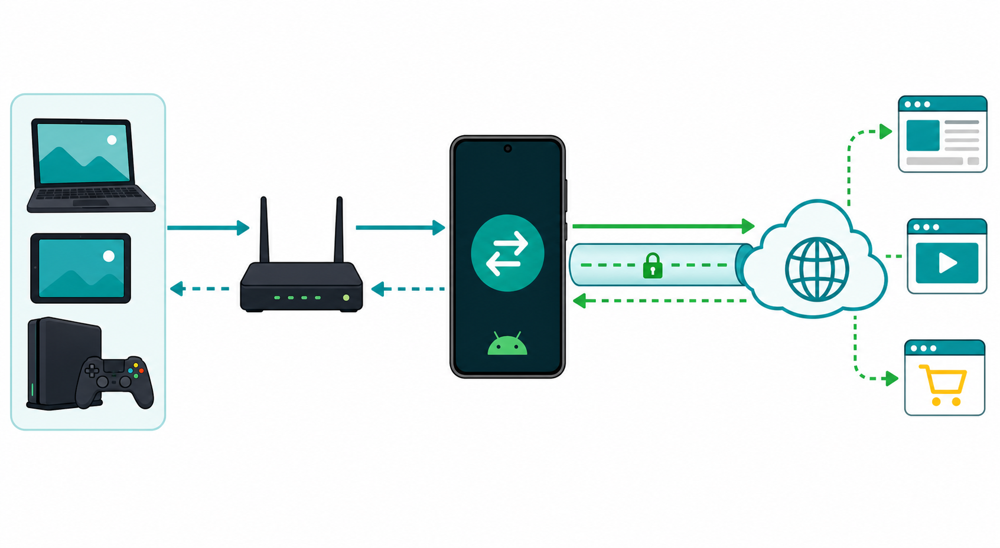

# Getting Started

English | [简体中文](GETTING_STARTED.zh-CN.md)

This guide explains the app without assuming prior proxy knowledge.



## What The Phone Does

The phone is a proxy server on your existing LAN. It does not create a Wi-Fi hotspot and does not replace your router.

```text
              Proxy request                         Normal outbound connection

Laptop/TV/Console  <---->  Wi-Fi router  <---->  Android phone  <---->  Internet
                                               HTTP :8080
                                               SOCKS5 :1080
```

The client connects to the phone's LAN IP. The phone opens the destination connection using Android's current default route. If another VPN app is active on the phone, that VPN normally becomes the proxy server's outbound route.

## Choose A Protocol

| Protocol | Default | Use it when |
| --- | ---: | --- |
| HTTP | `8080` | The client has a normal HTTP proxy field or needs HTTPS through `CONNECT` |
| SOCKS5 | `1080` | The client explicitly supports SOCKS5 and can proxy DNS with `socks5h` |

Do not configure the HTTP port as SOCKS5 or the SOCKS5 port as HTTP. Neither service uses a username or password.

## Setup

1. Connect the Android phone and client device to the same trusted Wi-Fi or LAN.
2. Open Android Proxy Server and note the displayed LAN address, for example `192.168.1.2`.
3. Enable HTTP, SOCKS5, or both.
4. Enter the phone address and matching port in the client application.
5. Keep the Android foreground-service notification active while using the proxy.

```text
HTTP proxy
Host: 192.168.1.2
Port: 8080
Authentication: none

SOCKS5 proxy
Host: 192.168.1.2
Port: 1080
Authentication: none
```

Replace `192.168.1.2` with the address shown by the app.

## Command-Line Test

On Windows PowerShell, use `curl.exe` rather than the `curl` alias.

```powershell
curl.exe --proxy http://192.168.1.2:8080 https://example.com
curl.exe --proxy socks5h://192.168.1.2:1080 https://example.com
```

Traffic should follow this path:

```text
Request
Client -> Router -> Android proxy -> Active VPN or default network -> Destination

Response
Destination -> Active VPN or default network -> Android proxy -> Router -> Client
```

## Troubleshooting

### The port cannot be reached

```text
Can the client ping/reach the phone?
        |
        +-- No  -> Check same Wi-Fi, guest network, AP isolation, and firewall rules.
        |
        +-- Yes -> Confirm the service switch is on and the port matches the protocol.
```

Some routers prevent Wi-Fi clients from talking to each other. Disable guest-network isolation or AP/client isolation when appropriate.

### HTTP works but SOCKS5 does not

- Confirm the client is configured for SOCKS5, not SOCKS4 or HTTP.
- Use port `1080` unless you changed it in the app.
- Remove username/password fields; the server uses no authentication.
- For command-line DNS through the proxy, use `socks5h://`, not `socks5://`.

### The connection opens but websites do not load

- Check whether the phone itself can access the destination.
- Check the active VPN or Android default network route.
- Stop and restart the affected proxy service after changing VPN state.

### Active connections briefly change between zero and a small number

Applications, browsers, and proxy clients may open short health-check or DNS-related connections. The active count can change quickly even when no page is visibly loading. Session totals count completed connection attempts until the service stops.

## Safety

The proxy listens on all local interfaces and has no authentication. Use it only on a trusted LAN, stop it when not needed, and never forward ports `8080` or `1080` from a public router to the phone.

Read the [Security Policy](../SECURITY.md) and [Privacy Policy](../PRIVACY.md) for more details.
